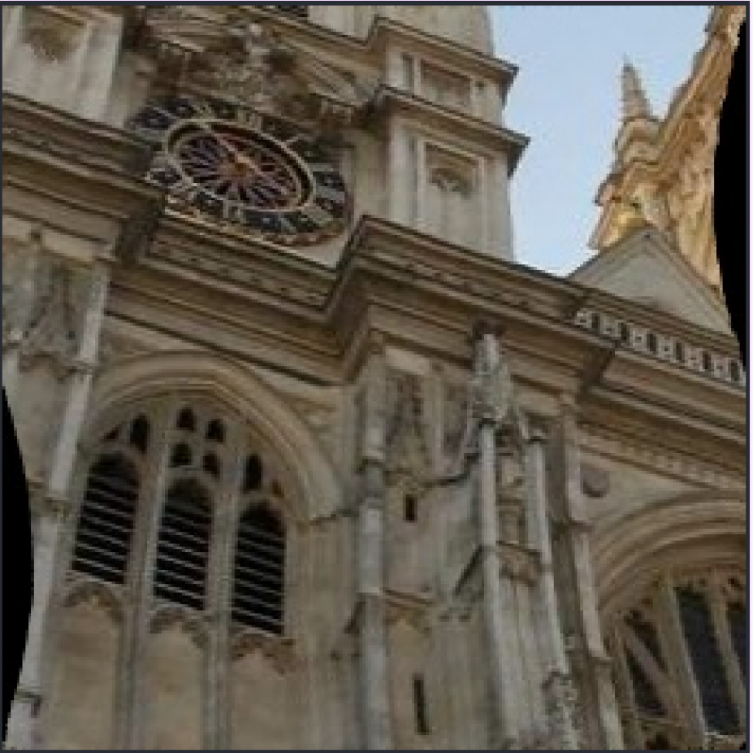

## 畸变图片:


## 去畸变后的图片：



## 1. 总体流程


## 2. 安装所需依赖

```shell
pip install opencv-python 
pip install numpy 
pip install scipy
```

## 3. 执行推理代码

```shell
python undistorted_img.py
```

执行后会弹出一个显示窗口左边为畸变的图片， 右边为去畸变的图片：


同时上图会保存到当前目录，名称为：`distorted_image_and_undistorted_image.jpg`


